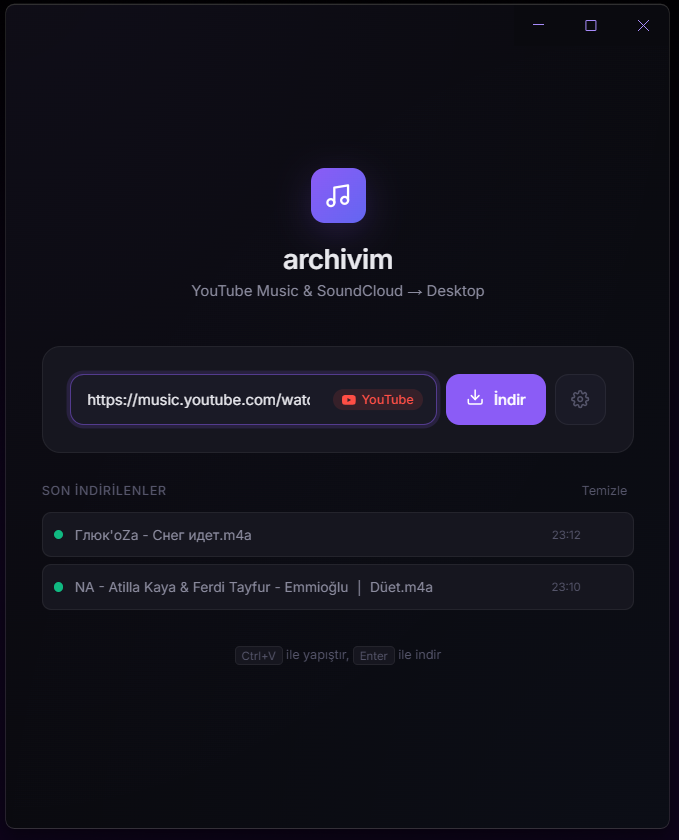
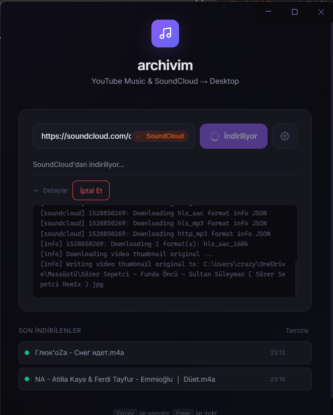

  
  <h1>Archivim</h1>
  
<b>A modern, blazingly fast, and elegant desktop application for downloading high-quality audio from YouTube and SoundCloud.</b>

---

## 🚀 Overview

**Archivim** is a standalone, frameless desktop application built to provide a seamless media downloading experience. It combines a stunning dark-themed user interface with the immense power of `yt-dlp` running under the hood. No complicated terminals, no confusing arguments—just paste a link and let Archivim handle the rest.

## ✨ Features

- **Pristine Audio Quality:** Extracts the best possible audio (`m4a` / `mp3`) natively.
- **Rich Metadata & Thumbnails:** Automatically embeds cover art and artist metadata directly into the downloaded audio files.
- **Smart URL Detection:** Automatically recognizes whether a link is from YouTube, YouTube Music, or SoundCloud, and applies the correct extraction logic.
- **Real-Time Progress:** Shows live download progress, speed, and real-time logs via Server-Sent Events (SSE).
- **Dynamic Clipboard Detection:** Automatically detects supported URLs in your clipboard when you focus the app.
- **Customizable Output:** Tweak quality, proxy settings, metadata options, and output directories with ease.
- **Portable `.exe`:** A single lightweight executable file—no installation required.

---

## 🛠️ Technology Stack

Archivim uses a modern, hybrid desktop architecture:

### 🖥️ Frontend (Renderer Process)
- **HTML5 & Vanilla JS:** Lightweight, zero-dependency interface.
- **CSS3 (Custom Design System):** Fully custom dark theme with glassmorphism effects, smooth micro-animations, and a completely custom frameless window title bar (drag region).
- **Server-Sent Events (SSE):** Used for receiving real-time terminal logs and progress updates directly from the backend.

### ⚙️ Backend (Main Process)
- **Electron (Node.js):** Manages the native frameless window and operating system integrations.
- **Node HTTP Server:** A localized API server (`http://127.0.0.1:8384`) handling the frontend's download requests and streaming `yt-dlp` logs back to the UI.
- **Child Processes:** Dynamically locates and safely spawns the `yt-dlp.exe` binary, piping `stdout/stderr` streams into structured JSON events.

---

## 🧩 How It Works

1. **User Input:** The user pastes a URL. The frontend detects the source and updates the UI accordingly.
2. **API Request:** A `POST` request is sent to the local Node.js server with the URL and user settings.
3. **Execution:** The server dynamically resolves the absolute path of `yt-dlp.exe` (bypassing Windows alias issues) and spawns it as a child process.
4. **Streaming Logs:** As `yt-dlp` runs, its output is read in real-time, parsed into percentages and log messages, and sent back to the frontend via SSE.
5. **Completion:** Once downloaded and metadata is embedded, the file is saved directly to the user's Desktop (or custom folder), and added to the app's persistent History list.

---

## 📖 Usage

### Running the App
Since Archivim is packaged as a portable executable, simply double-click **`archivim.exe`**.

### Downloading Music
1. Copy a YouTube, YouTube Music, or SoundCloud link.
2. Click inside Archivim. It will automatically detect the link in your clipboard.
3. Click the **İndir** (Download) button.
4. The audio file will be saved to your Desktop with embedded album art!

### Settings
Click the **Gear Icon** ⚙️ to open Settings. You can configure:
- Audio Format (`m4a`, `mp3`, `wav`, etc.)
- Metadata embedding and thumbnail conversions.
- File naming templates.
- Advanced `yt-dlp` arguments like `geo-bypass`, `retries`, and `sponsorblock`.

---

## 📸 Screenshots

  
   
  

---

  Built with ❤️ using Electron & yt-dlp

